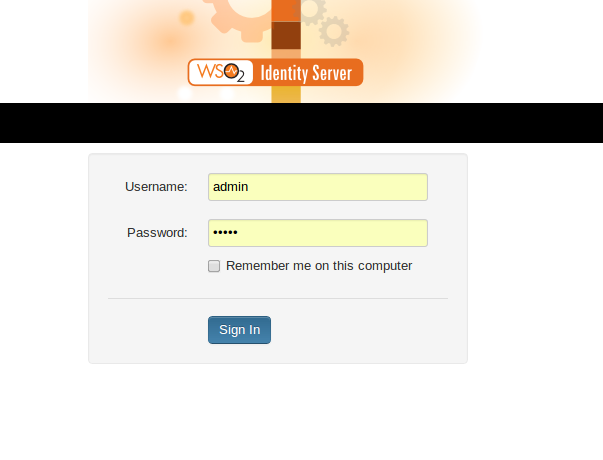
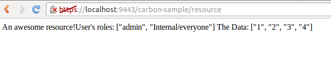

Introduction
============
This sample demonstrates;

- Using sso to secure a jag file
- Obtaining the roles of the currently logged in user

We will be performing user related operations using the classes found in the carbon module [here](https://github.com/wso2/jaggery-extensions/tree/master/carbon/module/scripts).

For this sample we will be using the UserManager and User classes found under the [scripts/user](https://github.com/wso2/jaggery-extensions/tree/master/carbon/module/scripts/user) directory.

This sample comes with a wrapper class which simplifies working with these classes.Please refer to the carbon-sample/modules/user-mgt.js.

**Note**:In order to simplify the sample we do not consider multitenancy.

Prerequisites
=============
This sample requires the following WSO2 products;

1. WSO2 Identity Server (IS) 4.6.0 [product page](http://wso2.com/products/business-activity-monitor/)
2. WSO2 Business Activity Monitor (BAM) 2.4.0 [product page](http://wso2.com/products/identity-server/)

Installation
============

1. In order to run both IS and BAM we will need to run IS with a port offset.This can be done by altering offset value found in the IS_HOME/repository/conf/carbon.xml file.For this example we have changed offset value to 5; 
2. Next start the WSO2 Identity Server instance by navigating to IS_HOME/ and typing sh bin/wso2server.sh
3. Configure a service provider entry  for the service provider 'carbonSample' from the IS management console.More information on this can be obtained from: https://docs.wso2.org/display/IS460/Adding+a+Service+Provider. Your service provider configuration should look like 
5. We need to enable SSO for the BAM server.This can be done by navigating to the BAM_HOME/repository/conf/security/authenticator.xml and enabling SSO  
6. Copy the contents of the resources/jar folder to BAM_HOME/repository/components/dropins directory
7. Copy the contents of the resources/modules directory to BAM_HOME/modules directory
8. Copy the carbon-sample folder into the BAM_HOME/repository/deployment/server/jaggeryapps/ directory.
9. Start the WSO2 BAM server instance by navigating to the BAM_HOME/ and typing sh bin/wso2server.sh

Trying out the sample
=====================
1. Navigate to the management console of the BAM server , using [https://localhost:9443/carbon/admin](https://localhost:9443/carbon/admin)
2. You will be presented with a SSO login screen (username:admin, password:admin) 
3. After you are logged in, navigate to the sample application: [https://localhost:9443/carbon-sample](https://localhost:9443/carbon-sample)
4. You will be redirected to the resource page and see the following message; 

User 
=====

The User class provides a set of methods to manage user related activities such as obtaining the roles of the user.A complete list of available methods is given below;

**Available Methods**

- getClaims
- setClaims
- getRoles
- hasRoles
- addRoles
- removeRoles
- updateRoles
- isAuthorize

We will be using the getRoles method in the sample.

